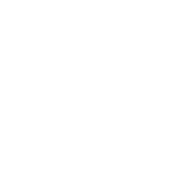
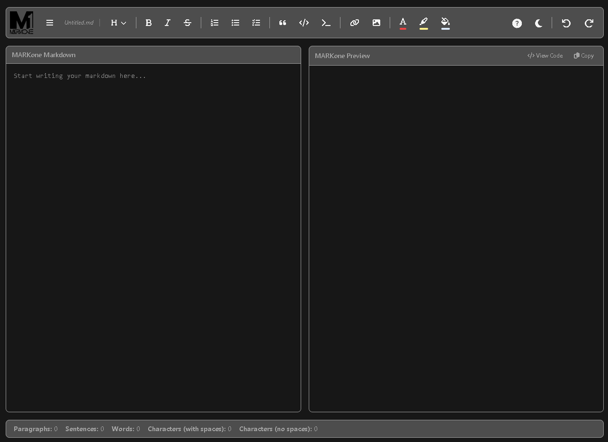

  
  
  # MARKone - Single File Portable Markdown Editor
  
  A feature-rich, browser-based Markdown editor with live preview and theming support.

  

## MarkOne.html is the only file you need to run the markdown editor.

## Features

### File Operations
- Create new Markdown files
- Open existing files
- Save files (with Save As functionality)
- Recent files list

### Text Formatting
- Headings (H1-H6)
- Bold, Italic, Strikethrough
- Ordered and Unordered Lists
- Checklists
- Blockquotes
- Inline code and code blocks
- Links and Images

### Styling
- Text color customization
- Background color highlighting
- Full background color theming
- Dark/Light theme toggle

### Editor Features
- Live Markdown preview
- Source code view
- Can write in the Code Pane or the Preview Pane
- Word, character, and paragraph counting
- Selection statistics
- Undo/Redo functionality
- Keyboard shortcuts for common actions

### UI/UX
- Clean, modern interface
- Responsive design
- Tooltips for all actions
- Visual indicators for active formatting
- Custom color pickers

### Additional Tools
- Built-in Markdown cheatsheet
- Copy Markdown functionality
- Syntax highlighting for code blocks
- Paragraph, Sentence, Word, Character Counter
- Keyword Density Checker: Highlight a word and it will tell you the number of occurrences that word appears and the percentage.

## License
Copyright © Josh McCann. 

This software is provided for free for open source and non-commercial purposes. Commercial usage is strictly prohibited without prior permission. Please contact the developer via GitHub for licensing inquiries.